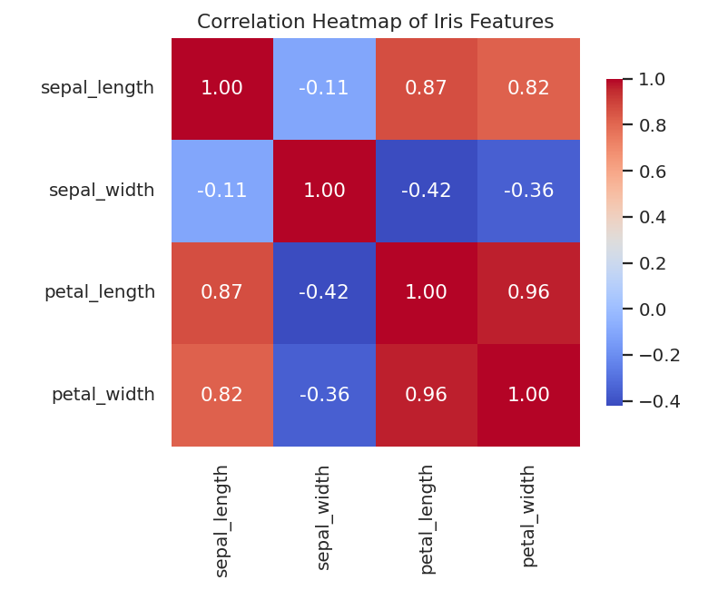
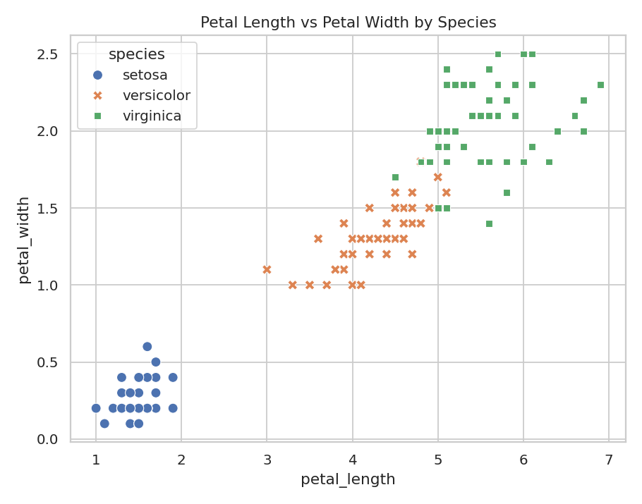

# 🌸 Iris Dataset — Exploratory Data Analysis (EDA)

An end-to-end exploratory data analysis of the classic **Iris flower dataset**, completed as part of a Data Science internship assignment. The project uses statistical summaries and visualizations to uncover patterns, identify correlations, and present insights in a structured report.


---

## 📌 Project Overview

| | |
|---|---|
| **Objective** | Analyze a dataset to uncover patterns and trends |
| **Dataset** | Iris dataset — 150 samples, 3 species, 4 numeric features |
| **Techniques** | Descriptive statistics, correlation analysis, univariate & multivariate visualization |
| **Deliverables** | Jupyter notebook, structured written report, exported charts |

## 🎯 Key Features

- 📊 Statistical summaries (overall and per-species)
- 🔗 Correlation analysis to identify key influencing factors
- 📈 Multiple visualization types: histograms, boxplots, violin plots, pairplot, heatmap, scatter plots
- 📝 Structured, written insights report (`report/REPORT.md`)

## 🖼️ Sample Visualizations

<p align="center">
  
  
</p>

## 🔑 Key Insights

1. The dataset is **clean and balanced** — no missing values, 50 samples per species.
2. **Petal length and petal width are almost perfectly correlated (r ≈ 0.96)** and are the strongest influencing factors for distinguishing species.
3. **Setosa** is easily separable from the other two species using petal measurements alone.
4. **Versicolor** and **virginica** overlap more, especially on sepal measurements, but remain distinguishable via petal features.
5. **Sepal width** is the weakest / most independent feature in the dataset.

Full write-up with charts and interpretation: [`report/REPORT.md`](report/REPORT.md)

## 📂 Repository Structure

```
iris-eda-project/
├── data/
│   └── iris.csv                  # Raw dataset
├── notebooks/
│   └── Iris_EDA.ipynb            # Full EDA notebook (code + outputs)
├── images/
│   └── *.png                     # Exported charts used in the report
├── report/
│   ├── REPORT.md                 # Structured written insights report
│   └── stats_summary.txt         # Raw statistical output
├── generate_analysis.py          # Script to regenerate all charts/stats
├── requirements.txt
├── LICENSE
└── README.md
```

## ⚙️ How to Run

```bash
# 1. Clone the repository
git clone https://github.com/<your-username>/iris-eda-project.git
cd iris-eda-project

# 2. Install dependencies
pip install -r requirements.txt

# 3a. Open the notebook
jupyter notebook notebooks/Iris_EDA.ipynb

# 3b. OR regenerate all charts/stats via script
python generate_analysis.py
```

## 🛠️ Tech Stack

- **Python 3**
- **Pandas** / **NumPy** — data manipulation
- **Matplotlib** / **Seaborn** — visualization
- **Jupyter Notebook** — analysis environment

## 📄 Dataset Source

The Iris dataset is a well-known dataset in machine learning and statistics, originally introduced by Ronald Fisher (1936). Sourced here as `iris.csv` for the assignment.

## 👤 Author

**Abhinay Gangwar**
B.Tech CSE (Data Science), ABES Engineering College (AKTU)
Data Science & AI Intern

---
*This project was completed as part of a Data Science internship's Exploratory Data Analysis assignment.*
